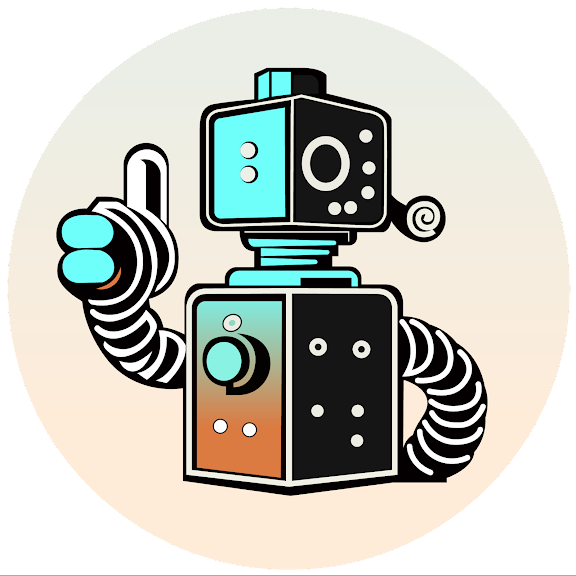
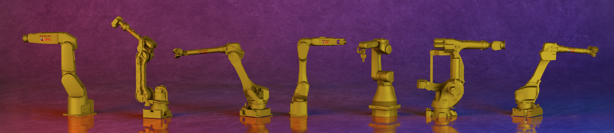
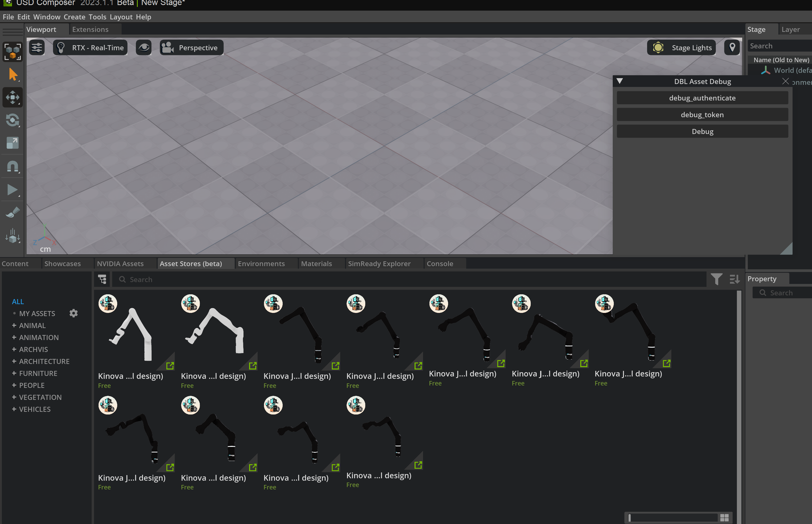

#  Digital Bot Lab: InsideroboConnector


# Overview: Bridging the Gap Between Digital Robots and Omniverse



The Digital Bot Lab's Insiderobo Connector is a cutting-edge solution designed to seamlessly connect our extensive digital robot collection with the powerful NVIDIA Omniverse platform. With our connector, users can effortlessly import digital robots in .usd format, enabling them to leverage the full potential of Omniverse applications.

## 1. Get Started

Experience the future of robotics with the Digital Bot Lab's Insiderobo Connector, where the connection between digital robots and Omniverse becomes effortless and transformative.



### 1.1 Install Omniverse USD Composer

This project is currently targeted for `Omniverse USD Composer`. Please follow the instructions to install it first:

[USD Composer Overview](https://docs.omniverse.nvidia.com/composer/latest/index.html#:~:text=NVIDIA%20Omniverse%E2%84%A2%20USD%20Composer,is%20based%20on%20Pixar's%20USD.)

### 1.2 Import the extension

To install the extension to Omniverse USD Composer:

First, clone the respository

```bash
git clone https://github.com/DigitalBotLab/InsideroboConnector
```

And now Open the `Omniverse USD Composer`, go to `Menu Bar` -> `Windows` -> `Extensions` -> `+` ->

Add your `<path_to_this_repository>/AssetProvider/dbl-exts-asset/exts`


## 2. Format: USD

Our digital robots are meticulously crafted and well-configured in .usd format, complete with physics, rigid bodies, and joints. This ensures a realistic and immersive experience when interacting with the robots within Omniverse.

## 3. ROS 

The Insiderobo Connector is built upon the foundation of the Robot Operating System (ROS), an open-source framework that empowers researchers and developers to easily build and reuse code across various robotics applications. This integration allows for enhanced collaboration, accelerated development, and seamless integration of digital robots into the Omniverse ecosystem.

## 4. License

Our project adheres to the Robot Operating System (ROS) framework, which enables us to develop and integrate robotic systems efficiently. We are proud to announce that our project is released under the BSD 3.0 license. This license ensures that our software is open-source, allowing users to freely use, modify, and distribute it while maintaining the necessary attribution and disclaimer requirements. By embracing ROS and the BSD 3.0 license, we aim to foster collaboration and innovation within the robotics community.


